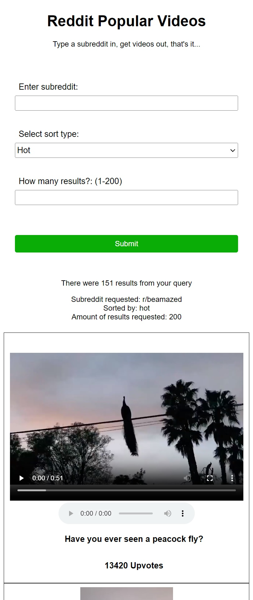
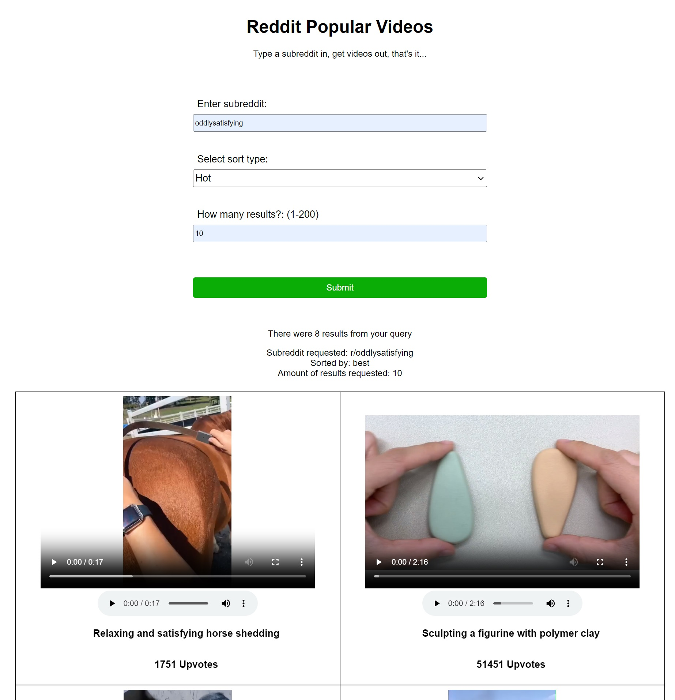

## What is this?

Simple web app which used the Reddit Api to fetch videos from the users choice of subreddits. \
\
First implemented fetching of the videos, then slowly added more content like the posts title, and upvote amount. \
The idea was to add more and more features like a search function and ability to see comments, but due to reddits api changes the app could stop working at anytime.\
\
As of 1 July 2023 the app is still working but I won't be adding any features due to the instability of reddit at the moment. Might re-visit this project in the future if it is again possible for third party devs to have free access to the api.

***Current Design Mobile***\

***Current Design Desktop***\

**Uses:** \
Reddit API\
Typescript\
Express\
Ejs\
Axios
